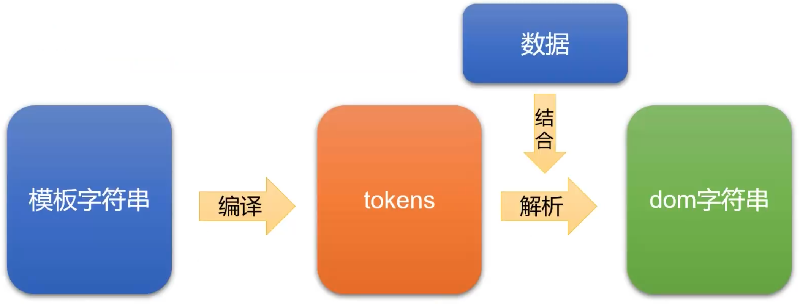
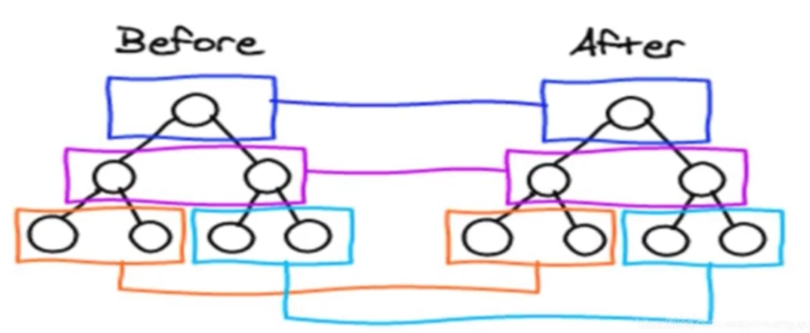
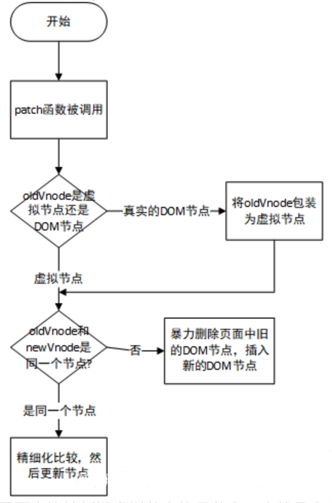
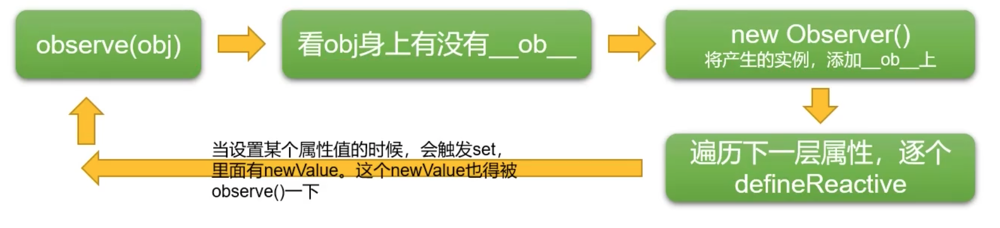
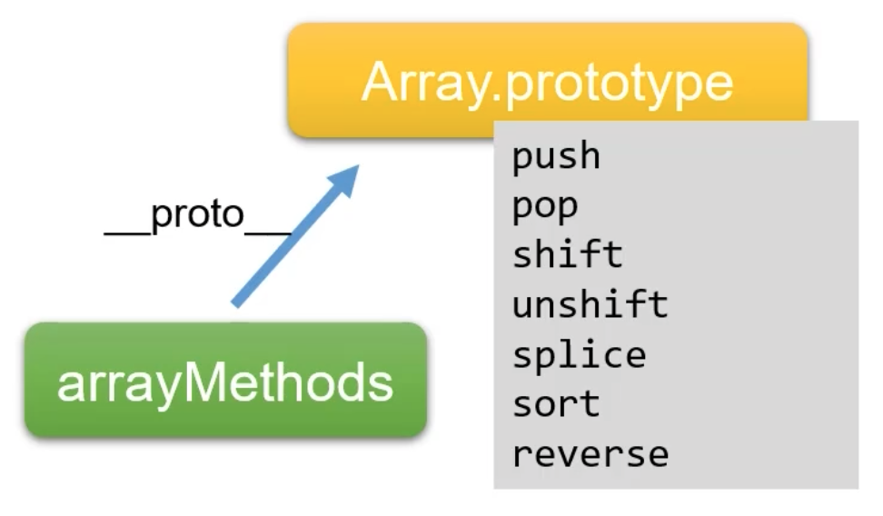
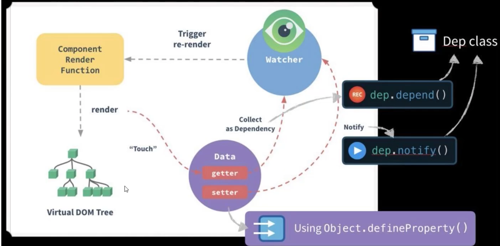
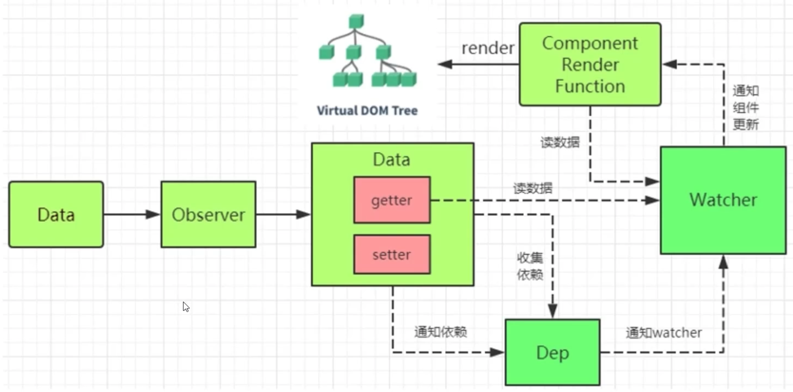
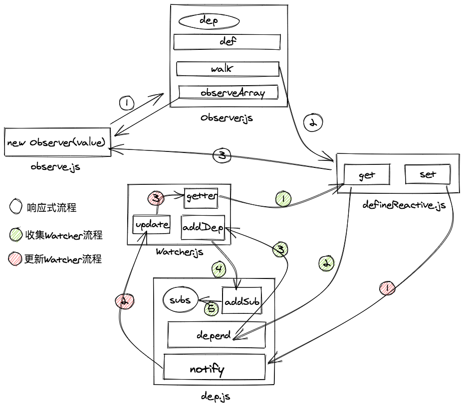
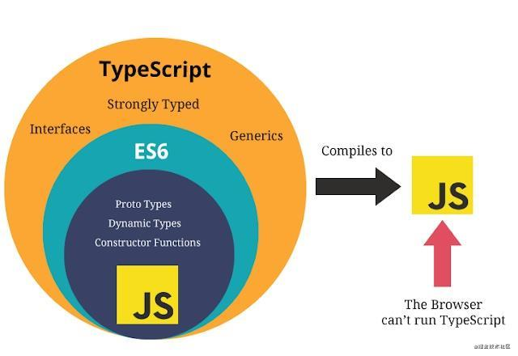

# Vue基础

## Vue基础概念

### 概念

遵循MVVM模式。

1. 借鉴Angular的模板和数据绑定技术
2. 借鉴React的组件化和虚拟DOM技术

### Vue Plugin及第三方库

vue-cli

vue-resource(axios) ajax请求

vue-router 路由

vuex 状态管理

vue-lazyload 懒加载

vue-scroller 页面滑动相关

mint-ui

element-ui

......

## Vue使用


### 指令

```html
// v-text v-html(理解成html)
<div v-text='data'></div>

// 强制绑定


<div :class='aClass'></div>
<div :style="{ font-size:'20px' }"></div>

// 绑定监听事件
<button v-on:click='clickFun'></button>
<button @click='clickFun'></button>

// 双向绑定
<input v-model='data'>

// 条件绑定 需要频繁切换使用v-show
<div v-if="prop"></div>
<div v-else></div>
<div v-show="ok"></div>

// 遍历数组
<ul>
    <li v-for="(p, i) in data" :key="i">
        {{p.name}}
    </li>
</ul>

// ref 指定唯一标识符，vue通过$els属性访问这个元素对象
<div ref="ref1"></div>

// v-cloak 防止闪现，与css配合 [v-cloak] { display:none}
<div v-cloak></div>
```

### 自定义指令

```js
// 注册全局指令
// binding 包含指令相关信息的数据变量
Vue.directive('my-directive', function(el, binding) {
    el.innerHTML = binding.value.toupperCase()
})

// 注册局部指令
directives: {
    'my-directive': {
        bind(el, binding) {
            el.innerHTML = binding.value.toupperCase()
        }
    }
}
// 使用指令
// v-my-derective='xxx'
```


### 属性

```js
const vm = new Vue({
    el:'#app',
    data: {
        temp:'Hello Vue'
    },
    methods:{
        
    },
    computed:{
		// 计算属性 存在缓存
        a() {
        	return 5
        }
	},
	watch:{
		// 监视属性
		b: function(value) {
			this.a = value + this.b
		}
	}
    // ...
})

vm.$watch('c', function(value) {
    console.log(value)
})
```

### 事件处理

#### 事件对象$event

```html
<button @click="a(123,$event)"></button>
```

```js
new Vue({
    el:'#app',
    methods:{
        // 事件中不传值自动event，若传值则需要传递
        a(event) {
            console.log(event)
        }
    }
})
```

#### 事件冒泡

```html
<div @click="a">
    // 点击此标签也会调用a方法
    // .stop和event.stopPropagation()相同 停止事件冒泡
    <div @click.stop="b"></div>
    // 相当于event.preventDefault() 阻止默认行为
    <div @click.prevent="b"></div>
</div>
```

#### 按键修饰符

```html
// event.target.value event.keyCode
// 绑定了enter按键时的方法
<input type="text" @keyup.enter="c">
<input type="text" @keyup.13="c">
```

### 生命周期


### Vue动画


**过渡的相关类名**

xxx-enter-active 指定显示的transition

xxx-leave-active 指定隐藏的transition

xxx-enter/xxx-leave-to 指定隐藏时的样式

```vue
<template>
	<transition name="xxx">
    	<p>textContent</p>
    </transition>
</template>

<style>
    .xxx-enter-active {
        transition: opacity 1s;
    }
    .xxx-enter {
        opacity: 0;
    }
</style>
```

### 过滤器

```js
Vue.filter('dataString', function(value) {
    let val;
    // 处理
    return val
})
```

### 插件 

```js
const MyPlugin = {
    install(Vue, options) {
      // 1. 添加全局方法或 property
      Vue.myGlobalMethod = function () {
        // 逻辑...
      }

      // 2. 添加全局资源
      Vue.directive('my-directive', {
        bind (el, binding, vnode, oldVnode) {
          // 逻辑...
        }
        ...
      })

      // 3. 注入组件选项
      Vue.mixin({
        created: function () {
          // 逻辑...
        }
        ...
      })

      // 4. 添加实例方法
      Vue.prototype.$myMethod = function (methodOptions) {
        // 逻辑...
      }
	}
};

// 将插件暴露出去
export default MyPlugin;
```

```js
// 在你调用 new Vue() 启动应用之前完成：
// 调用 `MyPlugin.install(Vue)`
Vue.use(MyPlugin)

new Vue({
  // ...组件选项
})
```

### 其他

do it yourself 看文档去


# Vue源码

## mustache

### 模板引擎

纯DOM法-->数组join法-->ES6的反引号法-->模板引擎

```html
<!-- 纯DOM -->
<script>
  var arr = [
    { "name": "jack", "age": 12, "sex": "男" }
  ]
  var list = document.getElementById('list')
  for(let i = 0; i < arr.length; i++) {
    let oLi = document.createElement('li');
    let hdDiv = document.createElement('div');
    hdDiv.className = 'hd';
    hdDiv.innerText = arr[i].name + '的基本信息';
    // ......
    oLi.appendChild(hdDiv);
    list.appendChild(oLi);
    // ......
  }
</script>
```

```html
<!-- 数组join法 -->
<script>
  for(let i = 0; i < arr.length; i++) {
    list.innerHTML += [
      '<li>',
      '	<div class="hd">' + arr[i].name + '的信息</div>',
      '	<div class="bd">',
      '		<p>姓名：' + arr[i].name + '</p>',
      '		<p>年龄：' + arr[i].age + '</p>',
      '		<p>性别：' + arr[i].sex + '</p>',
      '	</div>',
      '</li>'
    ].join('')
  }
</script>
```

```html
<!-- ES6的反引号法 -->
<script>
  for(let i = 0; i < arr.length; i++) {
    list.innerHTML += `
      <li>
      	<div class="hd">${arr[i].name}的信息</div>
				<div class="bd">
      		<p>姓名：${arr[i].name}</p>
      		<p>年龄：${arr[i].age}</p>
      		<p>性别：${arr[i].sex}</p>
				</div>
      </li>`
  }
</script>
```

```html
<!-- mustache -->
<script src="./mustache.js"></script>
<script>
    var data = {
        arr: [
            { "name": "jack", "age": 12, "sex": "男" }
        ]
    };
    var templateStr = `
    <ul>
      {{#arr}}
        <li>
          <div class="hd">{{name}}的基本信息</div>
          <div class="bd">
            <p>姓名：{{name}}</p>
            <p>年龄：{{age}}</p>
            <p>性别：{{sex}}</p>
          </div>
        </li>
      {{/arr}}
    </ul>`;
    var domStr = Mustache.render(templateStr, data)
    var container = document.getElementById('container');
  	container.innerHTML = domStr;
</script>
```

### 正则表达式

```js
var templateStr = '<h1>我买了一个{{thing}},价值{{price}}</h1>'
var data = {
  thing: "PC",
  price: 3000
}
function render(templateStr, data) {
  return templateStr..replace(/\{\{(\w+)\}\}/g, function(findStr, $1) {
    return data[$1];
  });
}
var result = render(templateStr, data)
```

### mustache库



## 虚拟DOM和diff算法

1. 虚拟DOM被渲染函数（h函数）产生
2. diff算法原理
3. 虚拟DOM通过diff编程真正的DOM

### snabbdom

```js
// 虚拟DOM的属性
{
  children: undefined // 子节点，undefined表示没有
  data: { // 属性样式
    props: {
      href: "http://www.baidu.com"
    }
  }
  elm: undefined // 该元素对应的真正的DOM节点，undefined表示还没有上树
  key: undefined // 节点唯一标识
  sel: "a" // selector选择器，节点类型
  text: "百度一下" // 文字
}
```

### diff

**只有是同一个虚拟节点**（选择器相同且key相同才是同一个），才进行精细化比较，否则就是暴力删除旧的、插入新的。

**只进行同层比较**，不会进行跨层比较。



**patch函数的比较过程**



**diff算法的比较顺序**

1. 新前、旧前
2. 新后、旧后
3. 新后、旧前
4. 新前、旧后
5. 如果都未命中，循环查找


## 数据响应式原理


```js
// Vue 非侵入式
this.a++;

// React 侵入式
this.setState({
  a: this.state.a + 1
})

// 小程序 侵入式
this.setData({
  a: this.data.a + 1
})
```

### Object.defineProperty()

数据劫持/数据代理：利用JavaScript引擎赋予的功能，检测对象属性变化。

具体详见**JavaScript笔记**内容



### Vue改写的Array.prototype中7种方法

原push、pop、shift、unshift、splice、sort、reverse七种方法定义在**Array.prototype**上。



```js
Object.setPrototypeOf(o, arrayMethods);
o.__proto__ = arrayMethods;
```

### 收集依赖

需要用到数据的地方，称为依赖

Vue1.x中，细粒度依赖，用到数据的DOM都是依赖

Vue2.x中，中等粒度依赖，用到数据的组件是依赖

在getter中收集依赖，在setter中触发依赖

#### Dep类和Watcher类

把依赖收集的代码封装成Dep类，每个Observer的实例，成员中都有一个Dep的实例。

Watcher是一个中介，数据发生变化时通过Watcher中转，通知组件







## AST抽象语法树

AST：Abstract Syntax Tree 服务于模板编译

模板 --> 抽象语法树AST --> 渲染函数（h函数） --> 虚拟节点 --> 界面


# Vue3 + TS

## TypeScript



**TypeScript 是 JavaScript 的一个超集**，主要提供了**类型系统**和**对 ES6+ 的支持**

TypeScript 主要有 3 大特点：

- **始于JavaScript，归于JavaScript**

TypeScript 可以编译出纯净、 简洁的 JavaScript 代码，并且可以运行在任何浏览器上、Node.js 环境中和任何支持 ECMAScript 3（或更高版本）的JavaScript 引擎中。

- **强大的类型系统**

**类型系统**允许 JavaScript 开发者在开发 JavaScript 应用程序时使用高效的开发工具和常用操作比如静态检查和代码重构。

- **先进的 JavaScript**

TypeScript 提供最新的和不断发展的 JavaScript 特性，包括那些来自 2015 年的 ECMAScript 和未来的提案中的特性，比如异步功能和 Decorators，以帮助建立健壮的组件。

### HelloWorld

```shell
npm install -g typescript
tsc —V # 安装成功
```


#### 监视tsconfig.json

```shell
tsc -init #生成配置文件tsconfig.json
// 在VSCode终端点击运行任务 -> tsc:监视tsconfig.json
```

#### 类型注解、接口、类

```typescript
// 定义一个类
class User {
  // 类型注解
  fullName: string
  firstName: string
  lastName: string
    
  constructor (firstName: string, lastName: string) {
    this.firstName = firstName
    this.lastName = lastName
    this.fullName = firstName + ' ' + lastName
  }
}
// 定义一个接口
interface Person {
  firstName: string
  lastName: string
}

function greeter (person: Person) {
  return 'Hello, ' + person.firstName + ' ' + person.lastName
}

let user = new User('Chen', 'Jin')
console.log(greeter(user))
```

#### webpack环境配置

```shell
# 版本问题见代码package.json
yarn add -D typescript
yarn add -D webpack webpack-cli
yarn add -D webpack-dev-server
yarn add -D html-webpack-plugin clean-webpack-plugin
yarn add -D ts-loader
yarn add -D cross-env
```

### TypeScript语法

#### 基础类型

```typescript
// 布尔值
let isFine: boolen = false;

// 数字 ECMAScript2015中的二进制和八进制
let a1: number = 10 // 十进制
let a2: number = 0b1010  // 二进制
let a3: number = 0o12 // 八进制
let a4: number = 0xa // 十六进制

// 字符串
let str: string = 'hello ts'

// undefined和null两种类型
let u: undefined = undefined
let n: null = null

// 数组
let list1: number[] = [1, 2, 3]
// 数组泛型
let list2: Array<number> = [1, 2, 3]

// 元组Tuple
let t1: [string, number]
t1 = ['jack', 18]

// 枚举
// 枚举数值默认从0开始依次递增
enum Color {
    Red,
    Green,
    Blue
}
// 也可以手动赋值编号
enum Color {Red = 1, Green = 2, Blue = 15}

// any 动态变化，通过编译阶段的检查
let notSure: any = 4
let list: any[] = [1, true, 'free']

// void 没有类型
let unusable: void = undefined
function fn(): void {
    // return undefined
    // return null
}

// object 表示非原始类型，除了number, string, boolean之外的类型
// 使用 object 类型，就可以更好的表示像 Object.create 这样的 API
function fn2(obj:object):object {
    console.log('fn2()', obj)
    return {}
    // return undefined
    // return null
}
console.log(fn2(new String('abc')))
// console.log(fn2('abc') // error
console.log(fn2(String))

// 联合类型Union Types，可取值为多种类型中的一个
// 需求1: 定义一个一个函数得到一个数字或字符串值的字符串形式值
function toString2(x: number | string) : string {
    return x.toString()
}
// 需求2: 定义一个一个函数得到一个数字或字符串值的长度
function getLength(x: number | string) {
    // return x.length // error
    if (x.length) { // error
        return x.length
    } else {
        return x.toString().length
    }
}

// 类型断言(Type Assertion): 可以用来手动指定一个值的类型
// 语法:
//    方式一: <类型>值
//    方式二: 值 as 类型  tsx中只能用这种方式
// 需求: 定义一个函数得到一个字符串或者数值数据的长度
function getLength(x: number | string) {
    if ((<string>x).length) {
        return (x as string).length
    } else {
        return x.toString().length
    }
}
console.log(getLength('abcd'), getLength(1234))

// 类型判断 TS会在没有明确的指定类型的时候推测出一个类型 
// 定义变量时赋值了, 推断为对应的类型
let b9 = 123 // number
// b9 = 'abc' // error
// 定义变量时没有赋值, 推断为any类型
let b10  // any类型
b10 = 123
b10 = 'abc'
```

#### 接口

```typescript
// 定义人的接口
interface IPerson {
    //  作为变量使用const 作为属性使用readonly
    readonly id: number // 只读属性
    name?: string // 可选属性
    age: number
    sex: string
}

// 函数类型
// 定义了函数的值和返回类型
interface SearchFunc {
    (source: string, subString: string): boolean
}
const mySearch: SearchFunc = function (source: string, sub: string): boolean {
    return source.search(sub) > -1
}

// 类类型
// 实现接口
interface Alarm {
    alert(): any;
}
interface Light {
    lightOn(): void;
    lightOff(): void;
}
class Car implements Alarm {
    alert() {
        console.log('Car alert');
    }
}
// 接口可以互相继承
interface LightableAlarm extends Alarm, Light {
}
```

#### 类

```typescript
class Greeter {
    // 声明属性
    message: string
    // 构造方法
    constructor (message: string) {
        this.message = message
    }
    // 一般方法
    greet (): string {
        return 'Hello ' + this.message
    }
}
```

##### 继承

```typescript
class Animal {
    run (distance: number) {
        console.log(`Animal run ${distance}m`)
    }
}
class Dog extends Animal {
    cry () {
        console.log('wang! wang!')
    }
}
const dog = new Dog()
dog.run(100) // 可以调用从父中继承得到的方法
```

##### 方法继承、 多态

```typescript
class Animal {
    name: string
    constructor (name: string) {
        this.name = name
    }
    run (distance: number=0) {
        console.log(`${this.name} run ${distance}m`)
    }
}
class Snake extends Animal {
    constructor (name: string) {
        // 调用父类型构造方法
        super(name)
    }
    // 重写父类型的方法 多态
    run (distance: number=5) {
        console.log('sliding...')
        // 调用父类型的一般方法
        super.run(distance)
    }
}
// 多态 父类型的引用指向了子类型的对象。
const anm: Animal = new Snake('眼镜蛇')
anm.run()
```

##### 修饰符

```typescript
// 修饰符
// 默认为public
class Person {
    public name: string // 公有
    private age: number = 18 // 私有
    protected sex: string = '男' // 保护
    readonly type: string = 'person' // 只读
    // 静态属性在类本身上而不在实例上，可以通过Person.name2来访问属性
    static name2: string = 'B' // 静态属性
}

class Person2 {
    // 参数属性来赋值和初始化name成员
    constructor(readonly name: string) {
    }
}
```

##### Getter/Setter

```typescript
class Person {
    firstName: string = 'A'
    lastName: string = 'B'
    get fullName () {
        return this.firstName + '-' + this.lastName
    }
    set fullName (value) {
        const names = value.split('-')
        this.firstName = names[0]
        this.lastName = names[1]
    }
}
```

##### 抽象类

```typescript
// 不同于接口，抽象类可以包含成员的实现细节
abstract class Animal {
    abstract cry ()
    run () {
        console.log('run()')
    }
}
class Dog extends Animal {
    cry () {
        console.log(' Dog cry()')
    }
}
const dog = new Dog()
dog.cry()
dog.run()
```

#### 函数

```typescript
// 命名函数
function add(x, y) {
  return x + y
}
// 匿名函数
let myAdd = function(x, y) { 
  return x + y;
}
```

##### 定义函数类型

```typescript
function add(x: number, y: number): number {
  return x + y
}
let myAdd = function(x: number, y: number): number { 
  return x + y
}
let myAdd2: (x: number, y: number) => number = 
function(x: number, y: number): number {
  return x + y
}
```

##### 可选参数和默认参数

```typescript
// 没个参数都是必须的，不能传递null或者undefined。可使用?来实现可选参数
function buildName(firstName: string='A', lastName?: string): string {
  if (lastName) {
    return firstName + '-' + lastName
  } else {
    return firstName
  }
}
```

##### 剩余参数

```typescript
// 对于多个参数，即个数不限的可选，可通过...来定义，并使用这个数组
function info(x: string, ...args: string[]) {
  console.log(x, args)
}
info('abc', 'c', 'b', 'a')
```

##### 函数重载

```typescript
// 函数名相同，而形参不同的多个函数
// 重载函数声明
function add (x: string, y: string): string
function add (x: number, y: number): number

// 定义函数实现
function add(x: string | number, y: string | number): string | number {
  // 在实现上我们要注意严格判断两个参数的类型是否相等，而不能简单的写一个 x + y
  if (typeof x === 'string' && typeof y === 'string') {
    return x + y
  } else if (typeof x === 'number' && typeof y === 'number') {
    return x + y
  }
}
```

#### 泛型

指在定义函数、接口或类的时候，不预先指定具体的类型，而在使用的时候再指定具体类型的一种特性。

```typescript
// 不使用泛型
function createArray(value: any, count: number): any[] {
    const arr: any[] = []
    for (let index = 0; index < count; index++) {
        arr.push(value)
    }
    return arr
}
const arr1 = createArray(11, 3)
const arr2 = createArray('aa', 3)
console.log(arr1[0].toFixed(), arr2[0].split(''))

// 使用泛型
function createArray2 <T> (value: T, count: number) {
    const arr: Array<T> = []
    for (let index = 0; index < count; index++) {
        arr.push(value)
    }
    return arr
}
const arr3 = createArray2<number>(11, 3)
console.log(arr3[0].toFixed())
// console.log(arr3[0].split('')) // error
const arr4 = createArray2<string>('aa', 3)
console.log(arr4[0].split(''))
// console.log(arr4[0].toFixed()) // error

// 多个泛型参数的函数
function swap <K, V> (a: K, b: V): [K, V] {
    return [a, b]
}
const result = swap<string, number>('abc', 123)
console.log(result[0].length, result[1].toFixed())
```

##### 泛型接口

```typescript
// 定义一个泛型接口
interface IbaseCRUD <T> {
    data: T[]
    add: (t: T) => void
    getById: (id: number) => T
}
// 定义一个类
class User {
    id?: number; //id主键自增
    name: string; //姓名
    age: number; //年龄

    constructor (name, age) {
        this.name = name
        this.age = age
    }
}
// 实现一个泛型接口的类
class UserCRUD implements IbaseCRUD <User> {
    data: User[] = []

    add(user: User): void {
        user = {...user, id: Date.now()}
        this.data.push(user)
        console.log('保存user', user.id)
    }

    getById(id: number): User {
        return this.data.find(item => item.id===id)
    }
}

const userCRUD = new UserCRUD()
userCRUD.add(new User('tom', 12))
userCRUD.add(new User('tom2', 13))
console.log(userCRUD.data)
```

##### 泛型类

```typescript
class GenericNumber<T> {
    zeroValue: T
    add: (x: T, y: T) => T
}
let myGenericNumber = new GenericNumber<number>()
myGenericNumber.zeroValue = 0
myGenericNumber.add = function(x, y) {
    return x + y 
}
let myGenericString = new GenericNumber<string>()
myGenericString.zeroValue = 'abc'
myGenericString.add = function(x, y) { 
    return x + y
}

console.log(myGenericString.add(myGenericString.zeroValue, 'test'))
console.log(myGenericNumber.add(myGenericNumber.zeroValue, 12))
```

##### 泛型约束

```typescript
// 没有泛型约束
function fn <T>(x: T): void {
  // console.log(x.length)  // error
}

// 通过泛型参数来实现，此时取length属性不会报错
interface Lengthwise {
  length: number;
}
// 指定泛型约束
function fn2 <T extends Lengthwise>(x: T): void {
  console.log(x.length)
}

fn2('abc')
// fn2(123) // error  number没有length属性
```

#### 其他

##### 声明文件

当使用第三方库时，我们需要引用它的声明文件，才能获得对应的代码补全、接口提示等功能

**声明语句：**假如我们想使用第三方库 jQuery，一种常见的方式是在 html 中通过 `<script>` 标签引入 `jQuery`，然后就可以使用全局变量 `$` 或 `jQuery` 了。

但是在 ts 中，编译器并不知道 $ 或 jQuery 是什么东西

```typescript
jQuery('#foo');
// ERROR: Cannot find name 'jQuery'.
```

创建 xxx.d.ts文件，将声明语句定义其中，TS扫描器会扫描并加载项目中所有的TS声明文件

```js
// 使用declare var来定义它的类型
// 定义全局变量的jQuery类型，仅用于编译时的检查。
declare var jQuery: (selector: string) => any;
```

编译的结果

```typescript
// 编译的结果
jQuery('#foo');
```

很多的第三方库都定义了对应的声明文件库, 库文件名一般为 `@types/xxx`

##### 内置对象

内置对象是指根据标准在全局作用域（Global）上存在的对象。这里的标准是指 ECMAScript 和其他环境（比如 DOM）的标准。

```typescript
// ECMAScript 的内置对象
let b: Boolean = new Boolean(1)
let n: Number = new Number(true)
let s: String = new String('abc')
let d: Date = new Date()
let r: RegExp = /^1/
let e: Error = new Error('error message')
b = true
// let bb: boolean = new Boolean(2)  // error

// BOM 和 DOM 的内置对象
// Window Document HTMLElement DocumentFragment Event NodeList
const div: HTMLElement = document.getElementById('test')
const divs: NodeList = document.querySelectorAll('div')
document.addEventListener('click', (event: MouseEvent) => {
  console.dir(event.target)
})
const fragment: DocumentFragment = document.createDocumentFragment()
```

## Vue3

### 对比Vue2

#### 性能提升

- 打包大小减少41%
- 初次渲染快55%, 更新渲染快133%
- 内存减少54%
- **使用Proxy代替defineProperty实现数据响应式**
- **重写虚拟DOM的实现和Tree-Shaking**

#### 新特性

- **Composition (组合) API**
- setup
  - ref 和 reactive
  - computed 和 watch
  - 新的生命周期函数
  - provide与inject
  - ...
- 新组件
  - Fragment - 文档碎片
  - Teleport - 瞬移组件的位置
  - Suspense - 异步加载组件的loading界面
- 其它API更新
  - 全局API的修改
  - 将原来的全局API转移到应用对象
  - 模板语法变化

### 创建Vue3项目

#### vue-cli

```bash
## 安装或者升级
npm install -g @vue/cli
## 保证 vue cli 版本在 4.5.0 以上
vue --version
## 创建项目
vue create my-project
```

- Please pick a preset - 选择 ***Manually select features***
- Check the features needed for your project - 选择上 ***TypeScript*** ，特别注意点空格是选择，点回车是下一步
- Choose a version of Vue.js that you want to start the project with - 选择 ***3.x (Preview)***
- Use class-style component syntax - 直接回车
- Use Babel alongside TypeScript - 直接回车
- Pick a linter / formatter config - 直接回车
- Use history mode for router? - 直接回车
- Pick a linter / formatter config - 直接回车
- Pick additional lint features - 直接回车
- Where do you prefer placing config for Babel, ESLint, etc.? - 直接回车
- Save this as a preset for future projects? - 直接回车

#### vite

- vite 是一个由原生 ESM 驱动的 Web 开发构建工具。在开发环境下基于浏览器原生 ES imports 开发，
- 它做到了***本地快速开发启动***, 在生产环境下基于 Rollup 打包。
  - 快速的冷启动，不需要等待打包操作；
  - 即时的热模块更新，替换性能和模块数量的解耦让更新飞起；
  - 真正的按需编译，不再等待整个应用编译完成，这是一个巨大的改变。

```bash
yarn create @vitejs/app
cd <project-name>
npm install
npm run dev
```

https://24kcs.github.io/vue3_study/chapter3/01_%E8%AE%A4%E8%AF%86Vue3.html#_2-%E6%80%A7%E8%83%BD%E6%8F%90%E5%8D%87

https://www.bilibili.com/video/BV1ra4y1H7ih?p=39&spm_id_from=pageDriver
