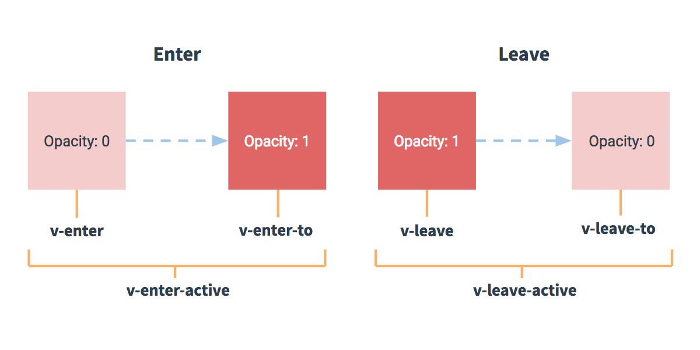
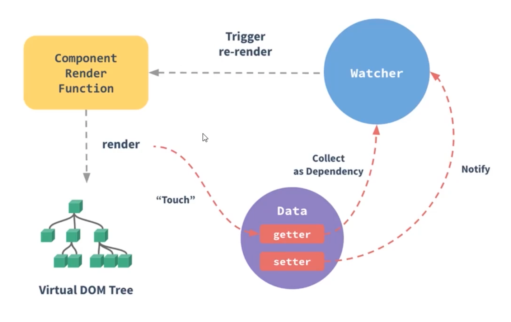
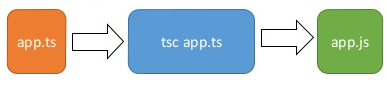

# Vue基础

## Vue基础概念

### 概念

遵循MVVM模式。

1. 借鉴Angular的模板和数据绑定技术
2. 借鉴React的组件化和虚拟DOM技术

### Vue Plugin及第三方库

vue-cli

vue-resource(axios) ajax请求

vue-router 路由

vuex 状态管理

vue-lazyload 懒加载

vue-scroller 页面滑动相关

mint-ui

element-ui

......

## Vue使用


### 指令

```html
// v-text v-html(理解成html)
<div v-text='data'></div>

// 强制绑定


<div :class='aClass'></div>
<div :style="{ font-size:'20px' }"></div>

// 绑定监听事件
<button v-on:click='clickFun'></button>
<button @click='clickFun'></button>

// 双向绑定
<input v-model='data'>

// 条件绑定 需要频繁切换使用v-show
<div v-if="prop"></div>
<div v-else></div>
<div v-show="ok"></div>

// 遍历数组
<ul>
    <li v-for="(p, i) in data" :key="i">
        {{p.name}}
    </li>
</ul>

// ref 指定唯一标识符，vue通过$els属性访问这个元素对象
<div ref="ref1"></div>

// v-cloak 防止闪现，与css配合 [v-cloak] { display:none}
<div v-cloak></div>
```

### 自定义指令

```js
// 注册全局指令
// binding 包含指令相关信息的数据变量
Vue.directive('my-directive', function(el, binding) {
    el.innerHTML = binding.value.toupperCase()
})

// 注册局部指令
directives: {
    'my-directive': {
        bind(el, binding) {
            el.innerHTML = binding.value.toupperCase()
        }
    }
}
// 使用指令
// v-my-derective='xxx'
```


### 属性

```js
const vm = new Vue({
    el:'#app',
    data: {
        temp:'Hello Vue'
    },
    methods:{
        
    },
    computed:{
		// 计算属性 存在缓存
        a() {
        	return 5
        }
	},
	watch:{
		// 监视属性
		b: function(value) {
			this.a = value + this.b
		}
	}
    // ...
})

vm.$watch('c', function(value) {
    console.log(value)
})
```

### 事件处理

#### 事件对象$event

```html
<button @click="a(123,$event)"></button>
```

```js
new Vue({
    el:'#app',
    methods:{
        // 事件中不传值自动event，若传值则需要传递
        a(event) {
            console.log(event)
        }
    }
})
```

#### 事件冒泡

```html
<div @click="a">
    // 点击此标签也会调用a方法
    // .stop和event.stopPropagation()相同 停止事件冒泡
    <div @click.stop="b"></div>
    // 相当于event.preventDefault() 阻止默认行为
    <div @click.prevent="b"></div>
</div>
```

#### 按键修饰符

```html
// event.target.value event.keyCode
// 绑定了enter按键时的方法
<input type="text" @keyup.enter="c">
<input type="text" @keyup.13="c">
```

### 生命周期


### Vue动画



**过渡的相关类名**

xxx-enter-active 指定显示的transition

xxx-leave-active 指定隐藏的transition

xxx-enter/xxx-leave-to 指定隐藏时的样式

```vue
<template>
	<transition name="xxx">
    	<p>textContent</p>
    </transition>
</template>

<style>
    .xxx-enter-active {
        transition: opacity 1s;
    }
    .xxx-enter {
        opacity: 0;
    }
</style>
```

### 过滤器

```js
Vue.filter('dataString', function(value) {
    let val;
    // 处理
    return val
})
```

### 插件 

```js
const MyPlugin = {
    install(Vue, options) {
      // 1. 添加全局方法或 property
      Vue.myGlobalMethod = function () {
        // 逻辑...
      }

      // 2. 添加全局资源
      Vue.directive('my-directive', {
        bind (el, binding, vnode, oldVnode) {
          // 逻辑...
        }
        ...
      })

      // 3. 注入组件选项
      Vue.mixin({
        created: function () {
          // 逻辑...
        }
        ...
      })

      // 4. 添加实例方法
      Vue.prototype.$myMethod = function (methodOptions) {
        // 逻辑...
      }
	}
};

// 将插件暴露出去
export default MyPlugin;
```

```js
// 在你调用 new Vue() 启动应用之前完成：
// 调用 `MyPlugin.install(Vue)`
Vue.use(MyPlugin)

new Vue({
  // ...组件选项
})
```

### 其他

do it yourself 看文档去


# Vue源码

## mustache

### 模板引擎

纯DOM法-->数组join法-->ES6的反引号法-->模板引擎

```html
<!-- 纯DOM -->
<script>
  var arr = [
    { "name": "jack", "age": 12, "sex": "男" }
  ]
  var list = document.getElementById('list')
  for(let i = 0; i < arr.length; i++) {
    let oLi = document.createElement('li');
    let hdDiv = document.createElement('div');
    hdDiv.className = 'hd';
    hdDiv.innerText = arr[i].name + '的基本信息';
    // ......
    oLi.appendChild(hdDiv);
    list.appendChild(oLi);
    // ......
  }
</script>
```

```html
<!-- 数组join法 -->
<script>
  for(let i = 0; i < arr.length; i++) {
    list.innerHTML += [
      '<li>',
      '	<div class="hd">' + arr[i].name + '的信息</div>',
      '	<div class="bd">',
      '		<p>姓名：' + arr[i].name + '</p>',
      '		<p>年龄：' + arr[i].age + '</p>',
      '		<p>性别：' + arr[i].sex + '</p>',
      '	</div>',
      '</li>'
    ].join('')
  }
</script>
```

```html
<!-- ES6的反引号法 -->
<script>
  for(let i = 0; i < arr.length; i++) {
    list.innerHTML += `
      <li>
      	<div class="hd">${arr[i].name}的信息</div>
				<div class="bd">
      		<p>姓名：${arr[i].name}</p>
      		<p>年龄：${arr[i].age}</p>
      		<p>性别：${arr[i].sex}</p>
				</div>
      </li>`
  }
</script>
```

```html
<!-- mustache -->
<script src="./mustache.js"></script>
<script>
    var data = {
        arr: [
            { "name": "jack", "age": 12, "sex": "男" }
        ]
    };
    var templateStr = `
    <ul>
      {{#arr}}
        <li>
          <div class="hd">{{name}}的基本信息</div>
          <div class="bd">
            <p>姓名：{{name}}</p>
            <p>年龄：{{age}}</p>
            <p>性别：{{sex}}</p>
          </div>
        </li>
      {{/arr}}
    </ul>`;
    var domStr = Mustache.render(templateStr, data)
    var container = document.getElementById('container');
  	container.innerHTML = domStr;
</script>
```

### 正则表达式

```js
var templateStr = '<h1>我买了一个{{thing}},价值{{price}}</h1>'
var data = {
  thing: "PC",
  price: 3000
}
function render(templateStr, data) {
  return templateStr..replace(/\{\{(\w+)\}\}/g, function(findStr, $1) {
    return data[$1];
  });
}
var result = render(templateStr, data)
```

### mustache库


## 虚拟DOM和diff算法

1. 虚拟DOM被渲染函数（h函数）产生
2. diff算法原理
3. 虚拟DOM通过diff编程真正的DOM

### snabbdom

```js
// 虚拟DOM的属性
{
  children: undefined // 子节点，undefined表示没有
  data: { // 属性样式
    props: {
      href: "http://www.baidu.com"
    }
  }
  elm: undefined // 该元素对应的真正的DOM节点，undefined表示还没有上树
  key: undefined // 节点唯一标识
  sel: "a" // selector选择器，节点类型
  text: "百度一下" // 文字
}
```

### diff

**只有是同一个虚拟节点**（选择器相同且key相同才是同一个），才进行精细化比较，否则就是暴力删除旧的、插入新的。

**只进行同层比较**，不会进行跨层比较。


**patch函数的比较过程**


**diff算法的比较顺序**

1. 新前、旧前
2. 新后、旧后
3. 新后、旧前
4. 新前、旧后
5. 如果都未命中，循环查找


## 数据响应式原理



```js
// Vue 非侵入式
this.a++;

// React 侵入式
this.setState({
  a: this.state.a + 1
})

// 小程序 侵入式
this.setData({
  a: this.data.a + 1
})
```

### Object.defineProperty()

数据劫持/数据代理：利用JavaScript引擎赋予的功能，检测对象属性变化。

具体详见**JavaScript笔记**内容


### Vue改写的Array.prototype中7种方法

原push、pop、shift、unshift、splice、sort、reverse七种方法定义在**Array.prototype**上。


```js
Object.setPrototypeOf(o, arrayMethods);
o.__proto__ = arrayMethods;
```

### 收集依赖

需要用到数据的地方，称为依赖

Vue1.x中，细粒度依赖，用到数据的DOM都是依赖

Vue2.x中，中等粒度依赖，用到数据的组件是依赖

在getter中收集依赖，在setter中触发依赖

#### Dep类和Watcher类

把依赖收集的代码封装成Dep类，每个Observer的实例，成员中都有一个Dep的实例。

Watcher是一个中介，数据发生变化时通过Watcher中转，通知组件


## AST抽象语法树

AST：Abstract Syntax Tree 服务于模板编译

模板 --> 抽象语法树AST --> 渲染函数（h函数） --> 虚拟节点 --> 界面


# Vue3 + TS

## TypeScript


**TypeScript 是 JavaScript 的一个超集**，主要提供了**类型系统**和**对 ES6+ 的支持**

TypeScript 主要有 3 大特点：

- **始于JavaScript，归于JavaScript**

TypeScript 可以编译出纯净、 简洁的 JavaScript 代码，并且可以运行在任何浏览器上、Node.js 环境中和任何支持 ECMAScript 3（或更高版本）的JavaScript 引擎中。

- **强大的类型系统**

**类型系统**允许 JavaScript 开发者在开发 JavaScript 应用程序时使用高效的开发工具和常用操作比如静态检查和代码重构。

- **先进的 JavaScript**

TypeScript 提供最新的和不断发展的 JavaScript 特性，包括那些来自 2015 年的 ECMAScript 和未来的提案中的特性，比如异步功能和 Decorators，以帮助建立健壮的组件。

### HelloWorld

```shell
npm install -g typescript
tsc —V # 安装成功
```



#### 监视tsconfig.json

```shell
tsc -init #生成配置文件tsconfig.json
// 在VSCode终端点击运行任务 -> tsc:监视tsconfig.json
```

#### 类型注解、接口、类

```typescript
// 定义一个类
class User {
  // 类型注解
  fullName: string
  firstName: string
  lastName: string
    
  constructor (firstName: string, lastName: string) {
    this.firstName = firstName
    this.lastName = lastName
    this.fullName = firstName + ' ' + lastName
  }
}
// 定义一个接口
interface Person {
  firstName: string
  lastName: string
}

function greeter (person: Person) {
  return 'Hello, ' + person.firstName + ' ' + person.lastName
}

let user = new User('Chen', 'Jin')
console.log(greeter(user))
```

#### webpack环境配置

```shell
# 版本问题见代码package.json
yarn add -D typescript
yarn add -D webpack webpack-cli
yarn add -D webpack-dev-server
yarn add -D html-webpack-plugin clean-webpack-plugin
yarn add -D ts-loader
yarn add -D cross-env
```

### TypeScript语法

#### 基础类型

```typescript
// 布尔值
let isFine: boolen = false;

// 数字 ECMAScript2015中的二进制和八进制
let a1: number = 10 // 十进制
let a2: number = 0b1010  // 二进制
let a3: number = 0o12 // 八进制
let a4: number = 0xa // 十六进制

// 字符串
let str: string = 'hello ts'

// undefined和null两种类型
let u: undefined = undefined
let n: null = null

// 数组
let list1: number[] = [1, 2, 3]
// 数组泛型
let list2: Array<number> = [1, 2, 3]

// 元组Tuple
let t1: [string, number]
t1 = ['jack', 18]

// 枚举
// 枚举数值默认从0开始依次递增
enum Color {
    Red,
    Green,
    Blue
}
// 也可以手动赋值编号
enum Color {Red = 1, Green = 2, Blue = 15}

// any 动态变化，通过编译阶段的检查
let notSure: any = 4
let list: any[] = [1, true, 'free']

// void 没有类型
let unusable: void = undefined
function fn(): void {
    // return undefined
    // return null
}

// object 表示非原始类型，除了number, string, boolean之外的类型
// 使用 object 类型，就可以更好的表示像 Object.create 这样的 API
function fn2(obj:object):object {
    console.log('fn2()', obj)
    return {}
    // return undefined
    // return null
}
console.log(fn2(new String('abc')))
// console.log(fn2('abc') // error
console.log(fn2(String))

// 联合类型Union Types，可取值为多种类型中的一个
// 需求1: 定义一个一个函数得到一个数字或字符串值的字符串形式值
function toString2(x: number | string) : string {
    return x.toString()
}
// 需求2: 定义一个一个函数得到一个数字或字符串值的长度
function getLength(x: number | string) {
    // return x.length // error
    if (x.length) { // error
        return x.length
    } else {
        return x.toString().length
    }
}

// 类型断言(Type Assertion): 可以用来手动指定一个值的类型
// 语法:
//    方式一: <类型>值
//    方式二: 值 as 类型  tsx中只能用这种方式
// 需求: 定义一个函数得到一个字符串或者数值数据的长度
function getLength(x: number | string) {
    if ((<string>x).length) {
        return (x as string).length
    } else {
        return x.toString().length
    }
}
console.log(getLength('abcd'), getLength(1234))

// 类型判断 TS会在没有明确的指定类型的时候推测出一个类型 
// 定义变量时赋值了, 推断为对应的类型
let b9 = 123 // number
// b9 = 'abc' // error
// 定义变量时没有赋值, 推断为any类型
let b10  // any类型
b10 = 123
b10 = 'abc'
```

#### 接口

```typescript
// 定义人的接口
interface IPerson {
    //  作为变量使用const 作为属性使用readonly
    readonly id: number // 只读属性
    name?: string // 可选属性
    age: number
    sex: string
}

// 函数类型
// 定义了函数的值和返回类型
interface SearchFunc {
    (source: string, subString: string): boolean
}
const mySearch: SearchFunc = function (source: string, sub: string): boolean {
    return source.search(sub) > -1
}

// 类类型
// 实现接口
interface Alarm {
    alert(): any;
}
interface Light {
    lightOn(): void;
    lightOff(): void;
}
class Car implements Alarm {
    alert() {
        console.log('Car alert');
    }
}
// 接口可以互相继承
interface LightableAlarm extends Alarm, Light {
}
```

#### 类

```typescript
class Greeter {
    // 声明属性
    message: string
    // 构造方法
    constructor (message: string) {
        this.message = message
    }
    // 一般方法
    greet (): string {
        return 'Hello ' + this.message
    }
}
```

##### 继承

```typescript
class Animal {
    run (distance: number) {
        console.log(`Animal run ${distance}m`)
    }
}
class Dog extends Animal {
    cry () {
        console.log('wang! wang!')
    }
}
const dog = new Dog()
dog.run(100) // 可以调用从父中继承得到的方法
```

##### 方法继承、 多态

```typescript
class Animal {
    name: string
    constructor (name: string) {
        this.name = name
    }
    run (distance: number=0) {
        console.log(`${this.name} run ${distance}m`)
    }
}
class Snake extends Animal {
    constructor (name: string) {
        // 调用父类型构造方法
        super(name)
    }
    // 重写父类型的方法 多态
    run (distance: number=5) {
        console.log('sliding...')
        // 调用父类型的一般方法
        super.run(distance)
    }
}
// 多态 父类型的引用指向了子类型的对象。
const anm: Animal = new Snake('眼镜蛇')
anm.run()
```

##### 修饰符

```typescript
// 修饰符
// 默认为public
class Person {
    public name: string // 公有
    private age: number = 18 // 私有
    protected sex: string = '男' // 保护
    readonly type: string = 'person' // 只读
    // 静态属性在类本身上而不在实例上，可以通过Person.name2来访问属性
    static name2: string = 'B' // 静态属性
}

class Person2 {
    // 参数属性来赋值和初始化name成员
    constructor(readonly name: string) {
    }
}
```

##### Getter/Setter

```typescript
class Person {
    firstName: string = 'A'
    lastName: string = 'B'
    get fullName () {
        return this.firstName + '-' + this.lastName
    }
    set fullName (value) {
        const names = value.split('-')
        this.firstName = names[0]
        this.lastName = names[1]
    }
}
```

##### 抽象类

```typescript
// 不同于接口，抽象类可以包含成员的实现细节
abstract class Animal {
    abstract cry ()
    run () {
        console.log('run()')
    }
}
class Dog extends Animal {
    cry () {
        console.log(' Dog cry()')
    }
}
const dog = new Dog()
dog.cry()
dog.run()
```

#### 函数

```typescript
// 命名函数
function add(x, y) {
  return x + y
}
// 匿名函数
let myAdd = function(x, y) { 
  return x + y;
}
```

##### 定义函数类型

```typescript
function add(x: number, y: number): number {
  return x + y
}
let myAdd = function(x: number, y: number): number { 
  return x + y
}
let myAdd2: (x: number, y: number) => number = 
function(x: number, y: number): number {
  return x + y
}
```

##### 可选参数和默认参数

```typescript
// 没个参数都是必须的，不能传递null或者undefined。可使用?来实现可选参数
function buildName(firstName: string='A', lastName?: string): string {
  if (lastName) {
    return firstName + '-' + lastName
  } else {
    return firstName
  }
}
```

##### 剩余参数

```typescript
// 对于多个参数，即个数不限的可选，可通过...来定义，并使用这个数组
function info(x: string, ...args: string[]) {
  console.log(x, args)
}
info('abc', 'c', 'b', 'a')
```

##### 函数重载

```typescript
// 函数名相同，而形参不同的多个函数
// 重载函数声明
function add (x: string, y: string): string
function add (x: number, y: number): number

// 定义函数实现
function add(x: string | number, y: string | number): string | number {
  // 在实现上我们要注意严格判断两个参数的类型是否相等，而不能简单的写一个 x + y
  if (typeof x === 'string' && typeof y === 'string') {
    return x + y
  } else if (typeof x === 'number' && typeof y === 'number') {
    return x + y
  }
}
```

#### 泛型

指在定义函数、接口或类的时候，不预先指定具体的类型，而在使用的时候再指定具体类型的一种特性。

```typescript
// 不使用泛型
function createArray(value: any, count: number): any[] {
    const arr: any[] = []
    for (let index = 0; index < count; index++) {
        arr.push(value)
    }
    return arr
}
const arr1 = createArray(11, 3)
const arr2 = createArray('aa', 3)
console.log(arr1[0].toFixed(), arr2[0].split(''))

// 使用泛型
function createArray2 <T> (value: T, count: number) {
    const arr: Array<T> = []
    for (let index = 0; index < count; index++) {
        arr.push(value)
    }
    return arr
}
const arr3 = createArray2<number>(11, 3)
console.log(arr3[0].toFixed())
// console.log(arr3[0].split('')) // error
const arr4 = createArray2<string>('aa', 3)
console.log(arr4[0].split(''))
// console.log(arr4[0].toFixed()) // error

// 多个泛型参数的函数
function swap <K, V> (a: K, b: V): [K, V] {
    return [a, b]
}
const result = swap<string, number>('abc', 123)
console.log(result[0].length, result[1].toFixed())
```

##### 泛型接口

```typescript
// 定义一个泛型接口
interface IbaseCRUD <T> {
    data: T[]
    add: (t: T) => void
    getById: (id: number) => T
}
// 定义一个类
class User {
    id?: number; //id主键自增
    name: string; //姓名
    age: number; //年龄

    constructor (name, age) {
        this.name = name
        this.age = age
    }
}
// 实现一个泛型接口的类
class UserCRUD implements IbaseCRUD <User> {
    data: User[] = []

    add(user: User): void {
        user = {...user, id: Date.now()}
        this.data.push(user)
        console.log('保存user', user.id)
    }

    getById(id: number): User {
        return this.data.find(item => item.id===id)
    }
}

const userCRUD = new UserCRUD()
userCRUD.add(new User('tom', 12))
userCRUD.add(new User('tom2', 13))
console.log(userCRUD.data)
```

##### 泛型类

```typescript
class GenericNumber<T> {
    zeroValue: T
    add: (x: T, y: T) => T
}
let myGenericNumber = new GenericNumber<number>()
myGenericNumber.zeroValue = 0
myGenericNumber.add = function(x, y) {
    return x + y 
}
let myGenericString = new GenericNumber<string>()
myGenericString.zeroValue = 'abc'
myGenericString.add = function(x, y) { 
    return x + y
}

console.log(myGenericString.add(myGenericString.zeroValue, 'test'))
console.log(myGenericNumber.add(myGenericNumber.zeroValue, 12))
```

##### 泛型约束

```typescript
// 没有泛型约束
function fn <T>(x: T): void {
  // console.log(x.length)  // error
}

// 通过泛型参数来实现，此时取length属性不会报错
interface Lengthwise {
  length: number;
}
// 指定泛型约束
function fn2 <T extends Lengthwise>(x: T): void {
  console.log(x.length)
}

fn2('abc')
// fn2(123) // error  number没有length属性
```

#### 其他

##### 声明文件

当使用第三方库时，我们需要引用它的声明文件，才能获得对应的代码补全、接口提示等功能

**声明语句：**假如我们想使用第三方库 jQuery，一种常见的方式是在 html 中通过 `<script>` 标签引入 `jQuery`，然后就可以使用全局变量 `$` 或 `jQuery` 了。

但是在 ts 中，编译器并不知道 $ 或 jQuery 是什么东西

```typescript
jQuery('#foo');
// ERROR: Cannot find name 'jQuery'.
```

创建 xxx.d.ts文件，将声明语句定义其中，TS扫描器会扫描并加载项目中所有的TS声明文件

```js
// 使用declare var来定义它的类型
// 定义全局变量的jQuery类型，仅用于编译时的检查。
declare var jQuery: (selector: string) => any;
```

编译的结果

```typescript
// 编译的结果
jQuery('#foo');
```

很多的第三方库都定义了对应的声明文件库, 库文件名一般为 `@types/xxx`

```bash
yarn add @types/jquery -D
```

##### 内置对象

内置对象是指根据标准在全局作用域（Global）上存在的对象。这里的标准是指 ECMAScript 和其他环境（比如 DOM）的标准。

```typescript
// ECMAScript 的内置对象
let b: Boolean = new Boolean(1)
let n: Number = new Number(true)
let s: String = new String('abc')
let d: Date = new Date()
let r: RegExp = /^1/
let e: Error = new Error('error message')
b = true
// let bb: boolean = new Boolean(2)  // error

// BOM 和 DOM 的内置对象
// Window Document HTMLElement DocumentFragment Event NodeList
const div: HTMLElement = document.getElementById('test')
const divs: NodeList = document.querySelectorAll('div')
document.addEventListener('click', (event: MouseEvent) => {
  console.dir(event.target)
})
const fragment: DocumentFragment = document.createDocumentFragment()
```

## Vue3

### 对比Vue2

#### 性能提升

- 打包大小减少41%
- 初次渲染快55%, 更新渲染快133%
- 内存减少54%
- **使用Proxy代替defineProperty实现数据响应式**
- **重写虚拟DOM的实现和Tree-Shaking**

#### 新特性

- **Composition (组合) API**
- setup
  - ref 和 reactive
  - computed 和 watch
  - 新的生命周期函数
  - provide与inject
  - ...
- 新组件
  - Fragment - 文档碎片
  - Teleport - 瞬移组件的位置
  - Suspense - 异步加载组件的loading界面
- 其它API更新
  - 全局API的修改
  - 将原来的全局API转移到应用对象
  - 模板语法变化

### 创建Vue3项目

#### vue-cli

```bash
## 安装或者升级
npm install -g @vue/cli
## 保证 vue cli 版本在 4.5.0 以上
vue --version
## 创建项目
vue create my-project
```

#### vite

- vite 是一个由原生 ESM 驱动的 Web 开发构建工具。在开发环境下基于浏览器原生 ES imports 开发，
- 它做到了***本地快速开发启动***, 在生产环境下基于 Rollup 打包。
  - 快速的冷启动，不需要等待打包操作；
  - 即时的热模块更新，替换性能和模块数量的解耦让更新飞起；
  - 真正的按需编译，不再等待整个应用编译完成，这是一个巨大的改变。

```bash
yarn create @vitejs/app
```

### Composition API

#### setup

- 新的option, 所有的组合API函数都在此使用, 只在初始化时执行一次
- 函数如果返回对象, 对象中的属性或方法, 模板中可以直接使用

#### ref

- 作用: 定义一个数据的响应式
- 语法: const xxx = ref(initValue):
  - 创建一个包含响应式数据的引用(reference)对象
  - js中操作数据: xxx.value
  - 模板中操作数据: 不需要.value
- 一般用来定义一个基本类型的响应式数据

```vue
<template>
  <h2>{{count}}</h2>
  <hr>
  <button @click="update">更新</button>
</template>

<script>
  import { defineComponent, ref } from 'vue'
  export default defineComponent({
    /* 在Vue3中依然可以使用data和methods配置, 但建议使用其新语法实现 */
    // data () {
    //   return {
    //     count: 0
    //   }
    // },
    // methods: {
    //   update () {
    //     this.count++
    //   }
    // }

    /* 使用vue3的composition API */
    setup () {
      // 此数据不是响应式数据
      let data = 0
      // 定义响应式数据 ref对象
      const count = ref(1)
      console.log(count)
      // 更新响应式数据的函数
      function update () {
        // count++ Error错误
        // alert('update')
        count.value++
      }

      return {
        count,
        update
      }
    }
  })
</script>
```

#### reactive

- 作用: 定义多个数据的响应式
- const proxy = reactive(obj): 接收一个普通对象然后返回该普通对象的响应式代理器对象
- 响应式转换是“深层的”：会影响对象内部所有嵌套的属性
- 内部基于 ES6 的 Proxy 实现，通过代理对象操作源对象内部数据都是响应式的

```vue
<template>
  <div>Name: {{state.name}}</div>
  <div>Age: {{state.age}}</div>
  <div>Wife: {{state.wife}}</div>
  <div>Gender: {{state.gender}}</div>
  <button @click="update">按我一下</button>
</template>

<script lang="ts">
  import { defineComponent, reactive } from 'vue'
  export default defineComponent({
    setup () {
      const obj: any = {
        name: 'tom',
        age: 25,
        wife: {
          name: 'marry',
          age: 22
        },
      }
      // 定义响应式数据对象
      // 返回的是一个Proxy代理的对象，被代理者就是reactive中传入的对象
      const state = reactive(obj)
      console.log(state, state.wife)

      const update = () => {
        // 也可以直接操作obj对象
        // obj.name += '--'
        // obj.age += 1
        // state.wife.name += '++'
        // state.wife.age += 2

        // 更新变量不会重新渲染
        // obj.gender = '男'
        // delete obj.gender
        // 更新变量通过Proxy会渲染
        state.gender = '男'
        delete state.gender
      }

      return {
        obj,
        state,
        update,
      }
    }
  })
</script>
```

#### Vue2与Vue3响应式的区别

##### Vue2

- 核心:
  - 对象: 通过defineProperty对对象的已有属性值的读取和修改进行劫持(监视/拦截)
  - 数组: 通过重写数组更新数组一系列更新元素的方法来实现元素修改的劫持

```js
Object.defineProperty(data, 'count', {
    get () {}, 
    set () {}
})
```

- 问题
  - 对象直接新添加的属性或删除已有属性, 界面不会自动更新
  - 直接通过下标替换元素或更新length, 界面不会自动更新 arr[1] = {}

##### Vue3

- 通过Proxy(代理): 拦截对data任意属性的任意(13种)操作, 包括属性值的读写, 属性的添加, 属性的删除等...
- 通过 Reflect(反射): 动态对被代理对象的相应属性进行特定的操作

```typescript
const user = {
  name: "John",
  age: 12
};

// proxyUser是代理对象, user是被代理对象
// 后面所有的操作都是通过代理对象来操作被代理对象内部属性
const proxyUser = new Proxy(user, {
  get(target, prop) {
    console.log('劫持get()', prop)
    return Reflect.get(target, prop)
  },
  set(target, prop, val) {
    console.log('劫持set()', prop, val)
    return Reflect.set(target, prop, val); // (2)
  },
  deleteProperty (target, prop) {
    console.log('劫持delete属性', prop)
    return Reflect.deleteProperty(target, prop)
  }
});
// 读取属性值
console.log(proxyUser===user)
console.log(proxyUser.name, proxyUser.age)
// 设置属性值
proxyUser.name = 'bob'
proxyUser.age = 13
console.log(user)
// 添加属性
proxyUser.sex = '男'
console.log(user)
// 删除属性
delete proxyUser.sex
console.log(user)
```

#### setup细节

- setup执行的时机
  - **在beforeCreate之前执行(一次)**, 此时组件对象还没有创建
  - **this是undefined**, 不能通过this来访问data/computed/methods/props
  - 其实所有的composition API相关回调函数中也都不可以

- setup的返回值
  - 一般都返回一个对象: 为模板提供数据, 也就是模板中可以直接使用此对象中的所有属性/方法
  - 返回对象中的属性会与data函数返回对象的属性合并成为组件对象的属性
  - 返回对象中的方法会与methods中的方法合并成功组件对象的方法
  - **如果有重名, setup优先**
  - 注意:
  - 一般**不要混合使用**: methods中可以访问setup提供的属性和方法, 但在setup方法中不能访问data和methods
  - setup不能是一个async函数: 因为返回值不再是return的对象, 而是promise, 模板看不到return对象中的属性数据
- setup的参数
  - setup(props, context) / setup(props, {attrs, slots, emit})
  - props: 包含props配置声明且传入了的所有属性的对象
  - attrs: 包含没有在props配置中声明的属性的对象, 相当于 this.$attrs
  - slots: 包含所有传入的插槽内容的对象, 相当于 this.$slots
  - emit: 用来分发自定义事件的函数, 相当于 this.$emit

#### reactive与ref-细节

- 是Vue3的 composition API中2个最重要的响应式API
- ref用来处理基本类型数据, reactive用来处理对象(**递归深度响应式**)
- 如果用ref对象/数组, 内部会**自动将对象/数组转换为reactive的代理对象**
- ref内部: 通**过给value属性添加getter/setter来实现对数据的劫持**
- reactive内部: **通过使用Proxy来实现**对对象内部所有数据的劫持, 并通过Reflect操作对象内部数据
- ref的数据操作: 在js中要.value, 在模板中不需要(内部解析模板时会自动添加.value)

```typescript
const m1 = ref('abc')
const m2 = reactive({x: 1, y: {z: 'abc'}})
// 使用ref处理对象  ==> 对象会被自动reactive为proxy对象
const m3 = ref({a1: 2, a2: {a3: 'abc'}})
```

#### 计算属性与监视

- computed函数:
  - 与computed配置功能一致
  - 只有getter
  - 有getter和setter
- watch函数
  - 与watch配置功能一致
  - 监视指定的一个或多个响应式数据, 一旦数据变化, 就自动执行监视回调
  - 默认初始时不执行回调, 但可以通过配置immediate为true, 来指定初始时立即执行第一次
  - 通过配置deep为true, 来指定深度监视
- watchEffect函数
  - 不用直接指定要监视的数据, 回调函数中使用的哪些响应式数据就监视哪些响应式数据
  - 默认初始时就会执行第一次, 从而可以收集需要监视的数据
  - 监视数据发生变化时回调

```vue
<template>
  <h2>App</h2>
  fistName: <input v-model="user.firstName"/><br>
  lastName: <input v-model="user.lastName"/><br>
  fullName1: <input v-model="fullName1"/><br>
  fullName2: <input v-model="fullName2"><br>
  fullName3: <input v-model="fullName3"><br>

</template>

<script lang="ts">
import { reactive, ref, computed, watch, watchEffect } from 'vue'
export default {
  setup () {
    const user = reactive({
      firstName: 'A',
      lastName: 'B'
    })

    // 只有getter的计算属性
    const fullName1 = computed(() => {
      console.log('fullName1')
      return user.firstName + '-' + user.lastName
    })

    // 有getter与setter的计算属性
    const fullName2 = computed({
      get () {
        console.log('fullName2 get')
        return user.firstName + '-' + user.lastName
      },

      set (value: string) {
        console.log('fullName2 set')
        const names = value.split('-')
        user.firstName = names[0]
        user.lastName = names[1]
      }
    })

    const fullName3 = ref('')

    /* 
    watchEffect: 监视所有回调中使用的数据
    */
    /* 
    watchEffect(() => {
      console.log('watchEffect')
      fullName3.value = user.firstName + '-' + user.lastName
    }) 
    */

    /* 
    使用watch的2个特性:
      深度监视
      初始化立即执行
    */
    watch(user, () => {
      fullName3.value = user.firstName + '-' + user.lastName
    }, {
      immediate: true,  // 是否初始化立即执行一次, 默认是false
      deep: true, // 是否是深度监视, 默认是false
    })

    /* 
    watch一个数据
      默认在数据发生改变时执行回调
    */
    watch(fullName3, (value) => {
      console.log('watch')
      const names = value.split('-')
      user.firstName = names[0]
      user.lastName = names[1]
    })

    /* 
    watch多个数据: 
      使用数组来指定
      如果是ref对象, 直接指定
      如果是reactive对象中的属性,  必须通过函数来指定
    */
    watch([() => user.firstName, () => user.lastName, fullName3], (values) => {
      console.log('监视多个数据', values)
    })

    return {
      user,
      fullName1,
      fullName2,
      fullName3
    }
  }
}
</script>
```

#### Vue2和Vue3生命周期对比

Vue2中是生命周期回调，Vue3中是Composition API

- `beforeCreate` -> 使用 `setup()`
- `created` -> 使用 `setup()`
- `beforeMount` -> `onBeforeMount`
- `mounted` -> `onMounted`
- `beforeUpdate` -> `onBeforeUpdate`
- `updated` -> `onUpdated`
- `beforeDestroy` -> `onBeforeUnmount`
- `destroyed` -> `onUnmounted`
- `errorCaptured` -> `onErrorCaptured`

**新增的钩子函数**

组合式 API 还提供了以下调试钩子函数：

- onRenderTracked
- onRenderTriggered

```vue
<template>
<div class="about">
  <h2>msg: {{msg}}</h2>
  <hr>
  <button @click="update">更新</button>
  </div>
</template>

<script lang="ts">
  import { ref, onMounted, onUpdated, onUnmounted, onBeforeMount, onBeforeUpdate, onBeforeUnmount } from "vue"
  export default {
    beforeCreate () {
      console.log('beforeCreate()')
    },
    created () {
      console.log('created')
    },
    beforeMount () {
      console.log('beforeMount')
    },
    mounted () {
      console.log('mounted')
    },
    beforeUpdate () {
      console.log('beforeUpdate')
    },
    updated () {
      console.log('updated')
    },
    beforeUnmount () {
      console.log('beforeUnmount')
    },
    unmounted () {
      console.log('unmounted')
    },

    setup() {
      const msg = ref('abc')
      const update = () => {
        msg.value += '--'
      }
      onBeforeMount(() => {
        console.log('--onBeforeMount')
      })
      onMounted(() => {
        console.log('--onMounted')
      })
      onBeforeUpdate(() => {
        console.log('--onBeforeUpdate')
      })
      onUpdated(() => {
        console.log('--onUpdated')
      })
      onBeforeUnmount(() => {
        console.log('--onBeforeUnmount')
      })
      onUnmounted(() => {
        console.log('--onUnmounted')
      })
      return {
        msg,
        update
      }
    }
  }
</script>
```

#### 自定义hook函数

- 使用Vue3的组合API封装的可复用的功能函数
- 自定义hook的作用类似于vue2中的mixin技术
- 自定义Hook的优势: 很清楚复用功能代码的来源, 更清楚易懂

**例子1，用户鼠标点击的页面坐标**

```typescript
// hooks/useMousePosition.ts
import { ref, onMounted, onUnmounted } from 'vue'
/* 
收集用户鼠标点击的页面坐标
*/
export default function useMousePosition () {
  // 初始化坐标数据
  const x = ref(-1)
  const y = ref(-1)
  // 用于收集点击事件坐标的函数
  const updatePosition = (e: MouseEvent) => {
    x.value = e.pageX
    y.value = e.pageY
  }
  // 挂载后绑定点击监听
  onMounted(() => {
    document.addEventListener('click', updatePosition)
  })
  // 卸载前解绑点击监听
  onUnmounted(() => {
    document.removeEventListener('click', updatePosition)
  })
  return {x, y}
}
```

```vue
<template>
	<div>
  <h2>x: {{x}}, y: {{y}}</h2>
  </div>
</template>
<script>
  import { ref } from "vue"
  import useMousePosition from './hooks/useMousePosition'
  export default {
    setup() {
      const {x, y} = useMousePosition()
      return {
        x,
        y,
      }
    }
  }
</script>
```

**例子2，封装ajax请求的hook函数**

```typescript
// hooks/useRequire.ts
import { ref } from 'vue'
import axios from 'axios'
/* 
使用axios发送异步ajax请求
*/
export default function useUrlLoader<T>(url: string) {
  const result = ref<T | null>(null)
  const loading = ref(true)
  const errorMsg = ref(null)
  axios.get(url)
    .then(response => {
    loading.value = false
    result.value = response.data
  })
    .catch(e => {
    loading.value = false
    errorMsg.value = e.message || '未知错误'
  })
  return {
    loading,
    result,
    errorMsg,
  }
}
```

```vue
<template>
<div class="about">
  <h2 v-if="loading">LOADING...</h2>
  <h2 v-else-if="errorMsg">{{errorMsg}}</h2>
  <!-- <ul v-else>
<li>id: {{result.id}}</li>
<li>name: {{result.name}}</li>
<li>distance: {{result.distance}}</li>
  </ul> -->
  <ul v-for="p in result" :key="p.id">
    <li>id: {{p.id}}</li>
    <li>title: {{p.title}}</li>
    <li>price: {{p.price}}</li>
  </ul>
  <!--  -->
  </div>
</template>
<script lang="ts">
  import { watch } from "vue"
  import useRequest from './hooks/useRequest'
  // 地址数据接口
  interface AddressResult {
    id: number;
    name: string;
    distance: string;
  }
  // 产品数据接口
  interface ProductResult {
    id: string;
    title: string;
    price: number;
  }
  export default {
    setup() {
      // const {loading, result, errorMsg} = useRequest<AddressResult>('/data/address.json')
      const {loading, result, errorMsg} = useRequest<ProductResult[]>('/data/products.json')
      watch(result, () => {
        if (result.value) {
          console.log(result.value.length) // 有提示
        }
      })
      return {
        loading,
        result, 
        errorMsg
      }
    }
  }
</script>

```

#### toRefs

把一个响应式对象转换成普通对象，该普通对象的每个 property 都是一个 ref

应用: 当从合成函数返回响应式对象时，toRefs 非常有用，这样消费组件就可以在不丢失响应式的情况下对返回的对象进行分解使用

问题: reactive 对象取出的所有属性值都是非响应式的

解决: 利用 toRefs 可以将一个响应式 reactive 对象的所有原始属性转换为响应式的 ref 属性

```vue
<template>
  <h2>App</h2>
  <h3>foo: {{foo}}</h3>
  <h3>bar: {{bar}}</h3>
  <h3>foo2: {{foo2}}</h3>
  <h3>bar2: {{bar2}}</h3>
</template>
<script lang="ts">
  import { reactive, toRefs } from 'vue'
  export default {
    setup () {
      const state = reactive({
        foo: 'a',
        bar: 'b',
      })
      // 把响应式对象转换为普通对象，每一个property都是一个ref
      const stateAsRefs = toRefs(state)
      setTimeout(() => {
        state.foo += '++'
        state.bar += '++'
      }, 2000);
      const {foo2, bar2} = useReatureX()
      return {
        // ...state, 此时不是响应式数据了，解构了
        ...stateAsRefs, //通过转化再解构后可以
        foo2, 
        bar2
      }
    },
  }
  function useReatureX() {
    const state = reactive({
      foo2: 'a',
      bar2: 'b',
    })
    setTimeout(() => {
      state.foo2 += '++'
      state.bar2 += '++'
    }, 2000);
    return toRefs(state)
  }
</script>
```

#### ref获取元素

```vue
// 输入框自动获取焦点
<template>
  <h2>App</h2>
  <input type="text">---
  <input type="text" ref="inputRef">
</template>

<script lang="ts">
  import { onMounted, ref } from 'vue'
  // ref获取元素: 利用ref函数获取组件中的标签元素
  // 功能需求: 让输入框自动获取焦点
  export default {
    setup() {
      const inputRef = ref<HTMLElement|null>(null)
      onMounted(() => {
        inputRef.value && inputRef.value.focus()
      })
      return {
        inputRef
      }
    },
  }
</script>
```

### Composition API其他

#### shallowReactive与shallowRef

- shallowReactive : 只处理了对象内最外层属性的响应式(也就是浅响应式)
- shallowRef: 只处理了value的响应式, 不进行对象的reactive处理
- 什么时候用浅响应式呢?
  - 一般情况下使用ref和reactive即可
  - 如果有一个对象数据, 结构比较深, 但变化时只是外层属性变化 ===> shallowReactive
  - 如果有一个对象数据, 后面会产生新的对象来替换 ===> shallowRef

```typescript
setup () {
  const m1 = reactive({a: 1, b: {c: 2}})
  const m2 = shallowReactive({a: 1, b: {c: 2}})
  const m3 = ref({a: 1, b: {c: 2}})
  const m4 = shallowRef({a: 1, b: {c: 2}})
  const update = () => {
    // m1.b.c += 1 // 深响应
    // m2.b.c += 1 // 浅响应，不能改变
    // m3.value.a += 1 // 深响应
    m4.value.a += 1 // 浅响应，不能改变
  }
  return {
    m1,
    m2,
    m3,
    m4,
    update,
  }
}
```

#### readonly与sallowReadonly

- readonly:
  - 深度只读数据
  - 获取一个对象 (响应式或纯对象) 或 ref 并返回原始代理的只读代理。
  - 只读代理是深层的：访问的任何嵌套 property 也是只读的。
- shallowReadonly
  - 浅只读数据
  - 创建一个代理，使其自身的 property 为只读，但不执行嵌套对象的深度只读转换
- 应用场景:
  - 在某些特定情况下, 我们可能不希望对数据进行更新的操作, 那就可以包装生成一个只读代理对象来读取数据, 而不能修改或删除

```typescript
setup () {
  const state = reactive({
    a: 1,
    b: {
      c: 2
    }
  })
  // const rState1 = readonly(state)
  const rState2 = shallowReadonly(state)
  const update = () => {
    // rState1.a++ // error
    // rState1.b.c++ // error
    // rState2.a++ // error
    rState2.b.c++
  }
  return {
    state,
    update
  }
}
```

#### toRaw与markRaw

- toRaw
  - 返回由 `reactive` 或 `readonly` 方法转换成响应式代理的普通对象。
  - 这是一个还原方法，可用于临时读取，访问不会被代理/跟踪，写入时也不会触发界面更新。
- markRaw
  - 标记一个对象，使其永远不会转换为代理。返回对象本身
  - 应用场景:
    - 有些值不应被设置为响应式的，例如复杂的第三方类实例或 Vue 组件对象。
    - 当渲染具有不可变数据源的大列表时，跳过代理转换可以提高性能。

```typescript
setup () {
  const state = reactive<any>({
    name: 'tom',
    age: 25,
  })
  const testToRaw = () => {
    const user = toRaw(state)
    user.age++  // 界面不会更新
  }
  const testMarkRaw = () => {
    const likes = ['a', 'b']
    // state.likes = likes
    state.likes = markRaw(likes) // likes数组就不再是响应式的了
    setTimeout(() => {
      state.likes[0] += '--'
    }, 1000)
  }
  return {
    state,
    testToRaw,
    testMarkRaw,
  }
}
```

#### toRef

- 为源响应式对象上的某个属性创建一个 ref对象, 二者内部操作的是同一个数据值, 更新时二者是同步的
- 区别ref: 拷贝了一份新的数据值单独操作, 更新时相互不影响
- 应用: 当要将 某个prop 的 ref 传递给复合函数时，toRef 很有用

```vue
<template>
  <h2>App</h2>
  <p>{{state}}</p>
  <p>{{foo}}</p>
  <p>{{foo2}}</p>
  <button @click="update">更新</button>
  <Child :foo="foo"/>
</template>
<script lang="ts">
  /*
toRef:
  为源响应式对象上的某个属性创建一个 ref对象, 二者内部操作的是同一个数据值, 更新时二者是同步的
  区别ref: 拷贝了一份新的数据值单独操作, 更新时相互不影响
  应用: 当要将某个 prop 的 ref 传递给复合函数时，toRef 很有用
*/
  import {
    reactive,
    toRef,
    ref,
  } from 'vue'
  import Child from './Child.vue'
  export default {
    setup () {
      const state = reactive({
        foo: 1,
        bar: 2
      })
      const foo = toRef(state, 'foo')
      const foo2 = ref(state.foo)
      const update = () => {
        state.foo++
        // foo.value++
        // foo2.value++  // foo和state中的数据不会更新
      }
      return {
        state,
        foo,
        foo2,
        update,
      }
    },
    components: {
      Child
    }
  }
</script>
```

```vue
<template>
  <h2>Child</h2>
  <h3>{{foo}}</h3>
  <h3>{{length}}</h3>
</template>
<script lang="ts">
  import { computed, defineComponent, Ref, toRef } from 'vue'
  const component = defineComponent({
    props: {
      foo: {
        type: Number,
        require: true
      }
    },
    setup (props, context) {
      const length = useFeatureX(toRef(props, 'foo'))
      return {
        length
      }
    }
  })
  function useFeatureX(foo: Ref) {
    const length = computed(() => foo.value.length)
    return length
  }
  export default component
</script>

```

#### customRef

- 创建一个自定义的 ref，并对其依赖项跟踪和更新触发进行显式控制
- 需求: 使用 customRef 实现 debounce 的示例

```vue
<template>
  <h2>App</h2>
  <input v-model="keyword" placeholder="搜索关键字"/>
  <p>{{keyword}}</p>
</template>
<script lang="ts">
  import { ref, customRef } from 'vue'
  export default {
    setup () {
      const keyword = useDebouncedRef('', 500)
      console.log(keyword)
      return {
        keyword
      }
    },
  }
  /* 
实现函数防抖的自定义ref
*/
  function useDebouncedRef<T>(value: T, delay = 200) {
    let timeout: number
    return customRef((track, trigger) => {
      return {
        get() {
          // 告诉Vue追踪数据
          track()
          return value
        },
        set(newValue: T) {
          clearTimeout(timeout)
          timeout = setTimeout(() => {
            value = newValue
            // 告诉Vue去触发界面更新
            trigger()
          }, delay)
        }
      }
    })
  }
</script>
```

#### provide与inject

实现跨层级组件（祖孙）间通信

```vue
<template>
  <h1>父组件</h1>
  <p>当前颜色: {{color}}</p>
  <button @click="color='red'">红</button>
  <button @click="color='yellow'">黄</button>
  <button @click="color='blue'">蓝</button>
  <hr>
  <Son />
</template>
<script lang="ts">
  import { provide, ref } from 'vue'
  /* 
- provide` 和 `inject` 提供依赖注入，功能类似 2.x 的 `provide/inject
- 实现跨层级组件(祖孙)间通信
*/
  import Son from './Son.vue'
  export default {
    name: 'ProvideInject',
    components: {
      Son
    },
    setup() {
      const color = ref('red')
      provide('color', color)
      return {
        color
      }
    }
  }
</script>
```

```vue
<template>
  <div>
    <h2>子组件</h2>
    <hr>
    <GrandSon />
  </div>
</template>

<script lang="ts">
import GrandSon from './GrandSon.vue'
export default {
  components: {
    GrandSon
  },
}
</script>
```

```vue
<template>
  <h3 :style="{color}">孙子组件: {{color}}</h3>
  
</template>

<script lang="ts">
import { inject } from 'vue'
export default {
  setup() {
    const color = inject('color')

    return {
      color
    }
  }
}
</script>
```

#### 响应式数据的判断

- isRef: 检查一个值是否为一个 ref 对象
- isReactive: 检查一个对象是否是由 `reactive` 创建的响应式代理
- isReadonly: 检查一个对象是否是由 `readonly` 创建的只读代理
- isProxy: 检查一个对象是否是由 `reactive` 或者 `readonly` 方法创建的代理
